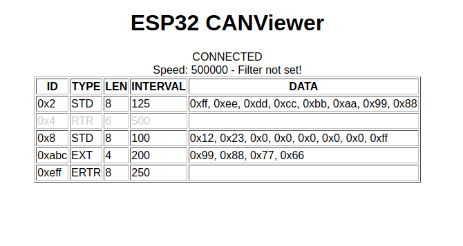

# ESP32 CANViewer
A ESP32 based CAN interface for your webbrowser

### Super basic webclient

## Requirements
### Libraries
- [Arduino CAN (Adafruit fork)](https://github.com/adafruit/arduino-CAN) or [Arduino CAN](https://github.com/sandeepmistry/arduino-CAN)
- [ESPAsyncWebServer](https://github.com/me-no-dev/ESPAsyncWebServer)
- [arduinoWebSockets](https://github.com/Links2004/arduinoWebSockets)
- [ArduinoJson](https://arduinojson.org/)

### Hardware
- ESP32
- 3.3V CAN Transceiver e.g. SN65HVD230

## Setup
1. Download the required libraries
2. Compile sketch and upload
3. Use the [ESP32 Sketch Data Upload Plugin](https://github.com/me-no-dev/arduino-esp32fs-plugin) to upload the data folder

## What should work?
### Server
The ESP32 tries to connect to your specified WIFI network. If no connection is possible it will start an access point.  
On port 80 a simple webserver is available that serves the index.html.  
The communication works via websockets on port 1337.  

The websockets accepts JSON strings.  
Currently the following commands are implemented on the server side:  
- SEND: `{"cmd":"SEND", "id":1, "dlc":4, "data":[4,5,6,7]}`  
creates a CAN packet with ID 0x1 and the four data bytes
- SETFILTER: `{"cmd":"SETFILTER", "id":8, "mask":2047}`  
sets the CAN acceptance filter to ID 0x8 and the MASK to 0x7FF (I don't know how to reset the filter so you need to reset the ESP in order to clear it)
- SETSPEED: `{"cmd":"SETSPEED", "speed":125000}`  
resets the CAN library and configures the desired speed (there are no plausibilty checks included from my side, use a valid speed)

The server broadcasts a STATUS message every second:   
`{"ts":1234,"type":"STATUS","baudrate":500000,"filterId":-1,"filterMask":-1}`  
ts: timestamp (Arduino millis)  
type: message type = STATUS  
baudrate: current baudrate  
filterId: currently set filter id (-1 means no filter set)  
filterMask: currently set filter mask (-1 means no filter set)  

Whenever a CAN packet gets received a message gets broadcasted:  
`{"ts":1234,"type":PACKETTYPE,"dlc":LENGTH,"data":[1,2,3,4,5,6,7,8]}`  
ts: timestamp (Arduino millis)  
type: message type
- STD: Standard CAN Frame
- EXT: Extended CAN Frame
- RTR: Remote Transmission Request
- ERTR: Extended Remote Transmission Request  

dlc: Data Length Code = 1-8 Bytes  
data: 0-8 Bytes of payload data, only in STD and EXT Frames  

### Client
The client is currently just a super simple first try. It just creates a HTML table with all received packets and is pretty ugly.
In javascript there are more functions available than what the GUI represents:  
- `setSpeed(speed)`  
e.g. setSpeed(125000); sets a baudrate of 125KBit/s
- `setFilter(id, mask)`  
e.g. setFilter(0x8, 0x7FF); sets the filter to only receive packets with id 0x8
- `sendPacket(id, dataArray)`  
e.g. sendPacket(0x8, [1,2,3,4,5]); sends a five byte CAN packet with id 0x8 and the content 1,2,3,4,5
